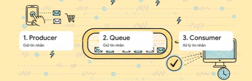
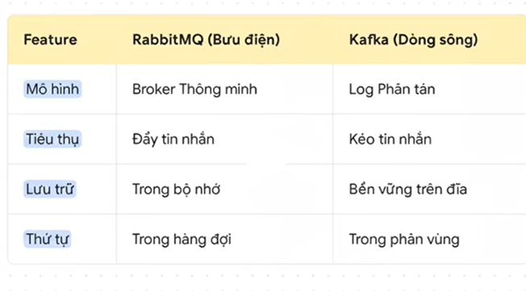

1. message queue:
      - Hệ thống nhắn tin giữa các thành phần của một ứng dụng hoặc giữa các ứng dụng khác nhau, cho phép chúng giao tiếp với nhau một cách hiệu quả và linh hoạt.
      - phòng chờ, tạo ra một vách ngăn ta biệt yêu cầu tức thời của người dùng khỏi nhưng công việc cần nhiều thười gian xữ lý hơn ở phía sau
      - tạo ra một hàng đợi để lưu trữ các tin nhắn, giúp cho việc xử lý tin nhắn trở nên hiệu quả hơn.
      - tách biệt yêu cầu của người dùng và xử lý của hệ thống, giúp cho hệ thống có thể xử lý nhiều yêu cầu cùng một lúc mà không bị quá tải.
      - các tin nhắn được lưu trữ trong hàng đợi cho đến khi chúng được xử lý, giúp cho hệ thống có thể xử lý các yêu cầu một cách tuần tự và đảm bảo rằng không có yêu cầu nào bị bỏ sót.
   ==> Giúp cho ứng dụng phản hồi ngay lâp tức 

Cơ chê: producer => message queue => consumer

trong đó: producer: là người gửi tin nhắn, có thể là một ứng dụng hoặc một dịch vụ nào đó (tạo việc)
          message queue: là nơi lưu trữ các tin nhắn, có thể là một hệ thống quản lý hàng đợi như RabbitMQ, Kafka, ...(giữ việc)
          consumer: là người nhận tin nhắn, có thể là một ứng dụng hoặc một dịch vụ nào đó (xữ lý việc)

lợi ích: - giúp cho hệ thống có thể xử lý nhiều yêu cầu cùng một lúc mà không bị quá tải.
         - tốc độ khả năng phản hồi tức thơi
         - khả năng mwor rộng, có thể thêm nhiều consumer để xữ lý các tin nhắn trong hàng đợi một cách nhanh chóng hơn.
         - giúp cho hệ thống có thể xử lý các yêu cầu một cách tuần tự và đảm bảo rằng không có yêu cầu nào bị bỏ sót.
         - khả năng chịu tải cao, xữ lý các request gửi đến lớn như ngày flash sale, black friday, ...
==> lựa chọn cho cac trường hợp: 
                   - xữ lý các công việc tốn nhiều thời gian, không cần thiết phải xữ lý ngay lập tức
                   - xữ lý các công việc có thể được thực hiện một cách bất đồng bộ
                   - xữ lý các công việc có thể được thực hiện một cách tuần tự
                   - xữ lý các công việc có thể được thực hiện một cách phân tán (tách nhiều service)

2. RabbitMQ: - một hệ thống quản lý hàng đợi mã nguồn mở, được viết bằng ngôn ngữ Erlang. 
             - được sinh ra bằng lĩnh vực taì chính, có khả năng chịu tải cao, độ tin cậy tuyệt đối.
             - mọi thứ được thiết lập để dữ liệu được đến nơi an toàn 
==> bưu điện thông minh
3. Kafka: - nền tảng lưu trữ và xữ lý phân tán
          - lưu trữ và thu thập và xữ lý những luồng dữ liệu lớn trong thời gian thực
          - được thiết kế để xử lý các luồng dữ liệu lớn và có khả năng mở rộng cao, có thể xử lý hàng triệu tin nhắn mỗi giây.
          - được sử dụng rộng rãi trong các ứng dụng như phân tích dữ liệu, giám sát hệ thống, và xử lý sự kiện thời gian thực.
==> cuốn nhật ký 

4. so sánh

Trong đó: - Broker thông minh chủ động gửi tin nhắn đến cho người nhận
          - Kafka người nhan tự kéo dữ liệu về đọc 
rabbitmq: tin nhắn chỉ là tạm thời đọc xong là mất(rabbitmq chức năng phức tạp độ tin cậy tuyệt đối)
Kafka: dữ liệu là tài sản được lưu lại một cách bền vưng. Cho phép nhiều nguoi đọc nhiều lần(kafka là chủ yếu về hiện năng)
5. Lựa chọn 
- dùng rabbitMQ khi dự án liên quan dến tiền bạc, khi cần định tuyến các tin nhắn phức tạp, khi viêc gửi tin phải chắc chác thành công và chính sách 
- dùng Kafka khi dự án liên quan đến việc xử lý dữ liệu lớn, khi cần khả năng mở rộng cao, khi cần khả năng chịu lỗi cao, khi cần khả năng phân tích dữ liệu thời gian thực
